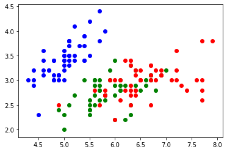
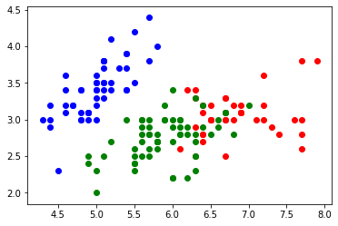

```python
# Import 3rd party dependencies.
import numpy as np
import pandas as pd
import matplotlib.pyplot as plt
from sklearn.metrics import accuracy_score

# Import custom k-means implementation.
from K_Mean import KMeans
```


```python
# Load the data.
data = pd.read_csv('iris.csv')

# Print the data table.
dataX = data[{'sepal_length', 'sepal_width', 'petal_length', 'petal_width'}]
dataY = data[{'class'}]
```


```python
x = KMeans(np.array(dataX),[],3)
centroids, closest_centroids_ids = x.train(50)

dataX['centroid'] = closest_centroids_ids
plt.scatter(data[data['class'] == 'SETOSA'].sepal_length,data[data['class'] == 'SETOSA'].sepal_width,color = 'blue')
plt.scatter(data[data['class'] == 'VERSICOLOR'].sepal_length,data[data['class'] == 'VERSICOLOR'].sepal_width,color = 'green')
plt.scatter(data[data['class'] == 'VIRGINICA'].sepal_length,data[data['class']  == 'VIRGINICA'].sepal_width,color = 'red')
plt.show()
```





```python
x = KMeans(np.array(dataX),[],3)

centroids, closest_centroids_ids = x.train(50)

dataX['centroid'] = closest_centroids_ids

plt.scatter(dataX[dataX.centroid == 2].sepal_length,dataX[dataX.centroid == 2].sepal_width,color = 'red')
plt.scatter(dataX[dataX.centroid == 1].sepal_length,dataX[dataX.centroid == 1].sepal_width,color = 'blue')
plt.scatter(dataX[dataX.centroid == 0].sepal_length,dataX[dataX.centroid == 0].sepal_width,color = 'green')

plt.show()
```





```python

```
